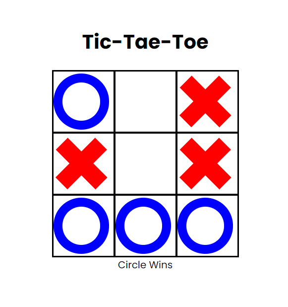

# Tic-Tac-Tae
### Description 
Tic-tac-toe, noughts and crosses, or Xs and Os is a paper-and-pencil game for two players who take turns marking the spaces in a three-by-three grid with X or O.
### Screenshot

